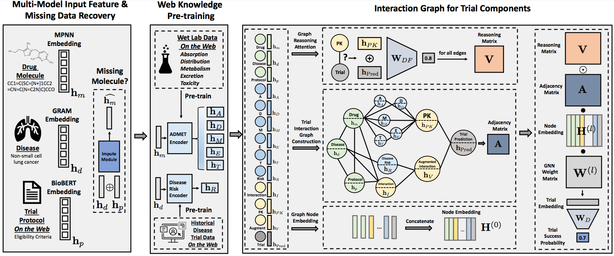

# HINT: Learn and Inference 


After processing the data, we apply the Hierarchical Interaction Network (HINT) to the subsequent four tasks. The diagram below depicts the HINT pipeline. All related scripts can be found in the HINT folder.


<p align="center"></p>


### Tutorial (Jupyter Notebook) 

[`tutorial_HINT.ipynb`](https://github.com/futianfan/clinical-trial-outcome-prediction/blob/main/tutorial_HINT.ipynb) the link is a tutorial to learn and evaluate HINT step by step. 


### Phase I/II/III Prediction (Bash command line)

Phase-level prediction predicts the success probability of a single phase study. 

```bash
python HINT/learn_phaseI.py
```


```bash
python HINT/learn_phaseII.py
```


```bash
python HINT/learn_phaseIII.py
```


### METRICS

PR-AUC (Precision-Recall Area Under Curve): This metric summarizes the trade-off between the true positive rate (recall) and the positive predictive value (precision) for a predictive model at various threshold settings.

F1 Score: The F1 score is the harmonic mean of precision and recall, providing a balance between the two in cases where one may be more influenced by extreme values.

ROC-AUC (Area Under the Receiver Operating Characteristic Curve): The ROC curve illustrates the trade-off between the true positive rate and the false positive rate at different thresholds, providing insight into the performance of a predictive model across all classification thresholds.


<!-- ### Result 

The empirical results are given for reference. The mean and standard deviation of 5 independent runs are reported. 

| Dataset  | PR-AUC | F1 | ROC-AUC |
|-----------------|-------------|-------------|------------|
| Phase I | 0.745 (0.009) | 0.820 (0.007) |  0.726 (0.009) |    
| Phase II | 0.685 (0.011) | 0.754 (0.010) | 0.698 (0.008)  |    
| Phase III | 0.709 (0.009) | 0.757 (0.008) | 0.784 (0.009) |    --> 


## Contact

Please contact cherrygsw@gmail.com for help or submit an issue.


## Code Architecture


- learn and inference on various task
  - `learn_phaseI.py`: predict whether the trial can pass phase I. 
  - `learn_phaseII.py`: predict whether the trial can pass phase II.
  - `learn_phaseIII.py`: predict whether the trial can pass phase III.
  - `learn_indication.py`: predict whether the trial can pass the indication (phase I-III).
- model architecture 
  - `model.py`
    - three model classes (`Interaction`, `HINT_nograph`, `HINTModel`), build model from simple to complex. 
  - `icdcode_encode.py` 
    - preprocess ICD-10 code, building ontology of icd-10 codes.
    - GRAM to model hierarchy of icd-10 code. 
  - `molecule_encode.py`
    - message passing network (MPN)
  - `protocol_encode.py`
    - protocol embeddor 
  - `module.py` contains standard implementation of existing neural module, e.g., highway, GCN
    - Highway Network 
    - Graph Convolutional Network (GCN) 


