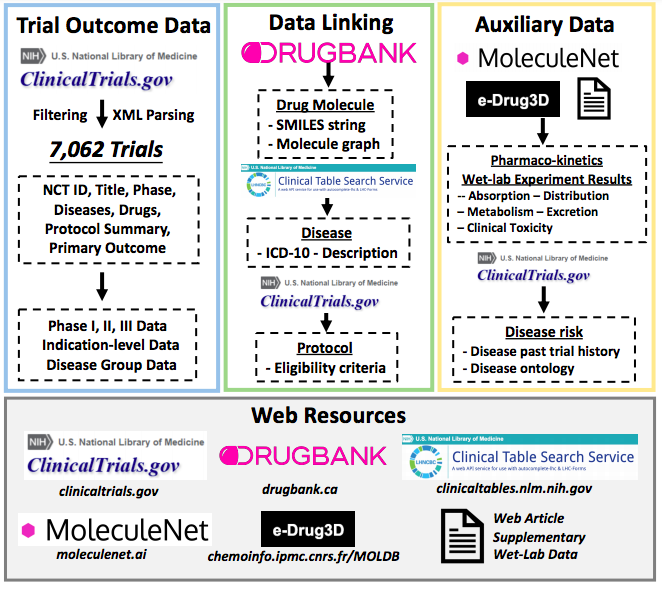

# Benchmark

To standardize clinical trial outcome prediction, we have developed a benchmark dataset called TOP (Trial Outcome Prediction), which includes comprehensive data components about clinical trials, such as information on the drugs, diseases, and protocols (including eligibility criteria). This benchmark can be primarily divided into two parts:

- `Raw Data` describes all the data sources. 
  - [`ClinicalTrial.gov`](https://clinicaltrials.gov): all the clinical trials records. 
  - [`DrugBank`](https://go.drugbank.com/): molecule structures of all the drugs. 
  - [`ClinicalTable`](https://clinicaltables.nlm.nih.gov/): API for ICD-10 codes. 
  - [`MoleculeNet`](https://moleculenet.org/): ADMET data. 
- `Data Curation Process` describes data curation process.
  - Collect all the records
  - diseases to icd10 
  - drug to SMILES 
  - ICD-10 code hierarchy
  - Sentence Embedding for trial protocol 
  - Selection criteria of clinical trial
  - Data split 
- Tutorial 

## Raw Data 

### ClinicalTrial.gov
- Description:
- Data Collection: We download all clinical trial records from ClinicalTrials.gov. The dataset we use is based on the ClinicalTrials.gov database as of February 20, 2021, and includes 348,891 records. This dataset is dynamic, growing over time as new clinical trial records are added. It provides detailed information about each clinical trial, including the NCT ID (unique identifiers for each study), disease names, drugs involved, brief titles and summaries, trial phases, eligibility criteria, and statistical analysis results.
  - **Outcome labels** are provided by **IQVIA**. 

- output
  - `./raw_data`: store all the xml files for all the trials (identified by NCT ID).  

<!-- When the `p-value` is smaller than 0.05, we take it as positive sample. Please see `benchmark/pseudolabel.py`.  -->


```bash 
mkdir -p raw_data
cd raw_data
wget https://clinicaltrials.gov/AllPublicXML.zip
```


Then we unzip the ZIP file. The unzipped file occupies over 8.6 G. Please make sure you have enough space. 
```bash 
unzip AllPublicXML.zip
cd ../
```

### DrugBank

- description
  - We use [DrugBank](https://go.drugbank.com/) to get the molecule structures ([SMILES](https://en.wikipedia.org/wiki/Simplified_molecular-input_line-entry_system), simplified molecular-input line-entry system) of the drug. 

- input
  - None 

- output
  - `data/drugbank_drugs_info.csv `  

### ClinicalTable

[ClinicalTable](https://clinicaltables.nlm.nih.gov/) is a public API to convert disease name (natural language) into ICD-10 code. 

### MoleculeNet
- description
  - MoleculeNet (https://moleculenet.org/) includes five datasets covering the primary categories of drug pharmacokinetics (PK). Here's how each category is addressed:

Absorption: We utilize the bioavailability dataset to study how drugs are absorbed into the bloodstream.

Distribution: For understanding how drugs distribute within the body, including crossing the blood-brain barrier, we use experimental results specific to the blood-brain barrier provided by MoleculeNet.

Metabolism: The metabolism of drugs is analyzed using data from the CYP2C19 experiment, available on the PubChem bioassay portal under Assay ID (AID) 1851.
Excretion: The clearance dataset from the eDrug3D database is used to assess how drugs are excreted from the body.

Toxicity: The ToxCast dataset, provided by MoleculeNet, is used to evaluate drug toxicity. A drug is considered non-toxic if it shows no toxic results across all toxicology assays, and toxic otherwise.

This comprehensive approach allows for a detailed analysis of drug behavior in the human body, providing essential insights for drug development and safety assessment.

- input
  - None 

- output 
  - `data/ADMET`

---

## Data Curation Process 

### Collect all the records
- description
  - download all the records from clinicaltrial.gov. The current version has 370K trial IDs. 

- input
  - `raw_data/`: raw data, store all the xml files for all the trials (identified by NCT ID).   

- output
  - `data/all_xml`: store NCT IDs for all the xml files for all the trials.  

```bash
find raw_data/ -name NCT*.xml | sort > data/all_xml
```


### Disease to ICD-10 code

- description

  - The diseases in [ClinicalTrialGov](clinicaltrials.gov) are described in natural language. 

  - On the other hand, [ICD-10](https://en.wikipedia.org/wiki/ICD-10) is the 10th revision of the International Statistical Classification of Diseases and Related Health Problems (ICD), a medical classification list by the World Health Organization (WHO). It leverages the hierarchical information inherent to medical ontologies. 

  - Then we use [ClinicalTable](https://clinicaltables.nlm.nih.gov/), an API that is public so we can convert disease names (natural language) into ICD-10 code. 

- input 
  - `raw_data/ ` 
  - `data/all_xml`   

- output
  -	`data/diseases.csv ` 

It takes around 2 hours. 

```bash 
python benchmark/collect_disease_from_raw.py
```


### drug to SMILES 

- description
  - [SMILES](https://en.wikipedia.org/wiki/Simplified_molecular-input_line-entry_system) is simplified molecular-input line-entry system of the molecule. 

  - The drugs in [ClinicalTrialGov](clinicaltrials.gov) are described in natural language. 

  - [DrugBank](https://go.drugbank.com/) contains rich information about drugs. 

  - We use [DrugBank](https://go.drugbank.com/) to get the molecule structures in terms of SMILES. 

- input
  - `data/drugbank_drugs_info.csv `  

- output
  - `data/drug2smiles.pkl `  

```bash
python benchmark/drug2smiles.py 
```


### Selection criteria of clinical trial

We design the following inclusion/exclusion criteria to select eligible clinical trials for learning. 

- inclusion criteria 
  - study-type is interventional 
  - intervention-type is small molecules drug
  - it has outcome label
  <!-- - p-value in primary-outcome is available -->
  - disease codes are available 
  - drug molecules are available 
  <!-- - eligibility criteria are available -->


- exclusion criteria 
  - study-type is observational 
  - intervention-type is surgery, biological, device
  - outcome label is not available 
  <!-- - p-value in primary-outcome is not available -->
  - disease codes are not available 
  - drug molecules are not available 
  <!-- - eligibility criteria are not available -->

The csv file contains following features:

* `nctid`: NCT ID, e.g., NCT00000378, NCT04439305. 
* `status`: `completed`, `terminated`, `active, not recruiting`, `withdrawn`, `unknown status`, `suspended`, `recruiting`. 
<!-- * `why_stop`: for completed, it is empty. Otherwise, the common reasons contain `slow/low/poor accrual`, `lack of efficacy` -->
* `label`: 0 (failure) or 1 (success).  
* `phase`: I, II, III or IV. 
* `diseases`: list of diseases. 
* `icdcodes`: list of icd-10 codes.
* `drugs`: list of drug names
* `smiless`: list of SMILES
* `criteria`: egibility criteria 

- input    
  - `data/diseases.csv ` 
  - `data/drug2smiles.pkl`  
  - `data/all_xml ` 

- output 
  - `data/raw_data.csv` 


```bash
python benchmark/collect_raw_data.py | tee data_process.log 
```


```bash
python benchmark/nctid2date.py 
```

- input
  - 'data/raw_data.csv'
  - './raw_data'

- output 
  - 'data/nctid_date.txt'


<!-- <p align="center"></p> -->


### Data Split 
- description (Split criteria)
  - phase I: phase I trials
  - phase II: phase II trials
  - phase III: phase III trials
- input
  - `data/raw_data.csv` 

- output: 
  - `data/phase_I_{train/valid/test}.csv` 
  - `data/phase_II_{train/valid/test}.csv` 
  - `data/phase_III_{train/valid/test}.csv` 


```bash
python benchmark/data_split.py 
```


### ICD-10 code hierarchy 

- description 
  - get all the ancestor code for the current icd-10 code. 

- input
  - `data/raw_data.csv` 

- output: 
  - `data/icdcode2ancestor_dict.pkl` 


```bash 
python benchmark/icdcode_encode.py 
```

### Sentence embedding 

- description 
  - BERT embedding to get sentence embedding for sentence in clinical protocol. 

- input
  - `data/raw_data.csv` 

- output: 
  - `data/sentence2embedding.pkl` 


```bash 
python benchmark/protocol_encode.py 
```


## Tutorial 

We have included a Jupyter notebook tutorial titled tutorial_benchmark.ipynb in the main folder, which outlines some crucial aspects of the data curation process. This tutorial provides step-by-step guidance on how to handle and understand the data, ensuring that users can efficiently work with the benchmark dataset and apply it effectively in their research or projects.


## Contact

Please contact cherrygsw@gmail.com for help or submit an issue. 


